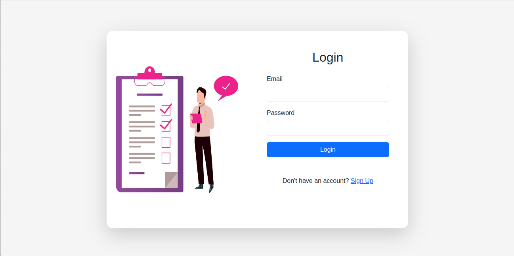
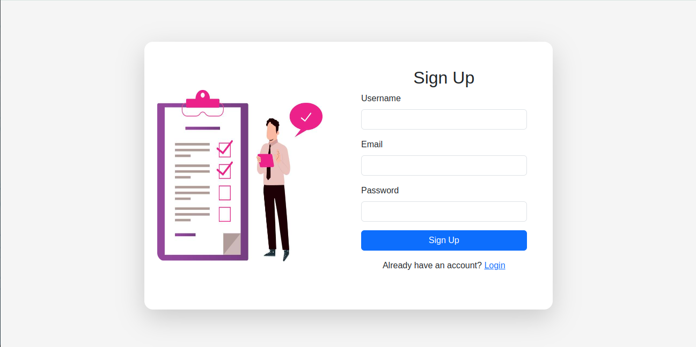
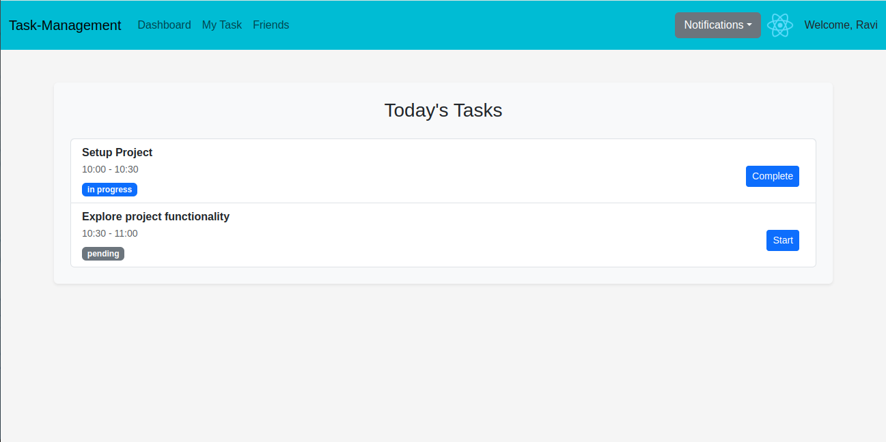
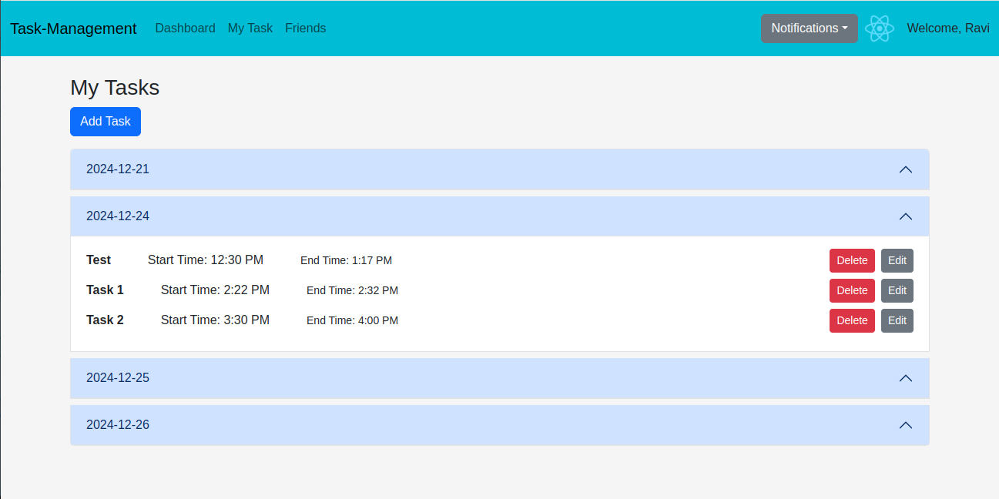
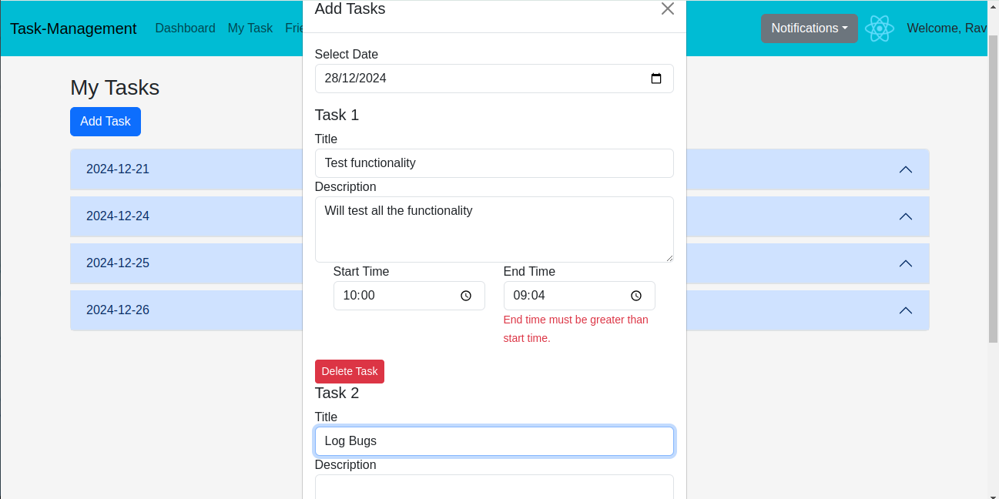
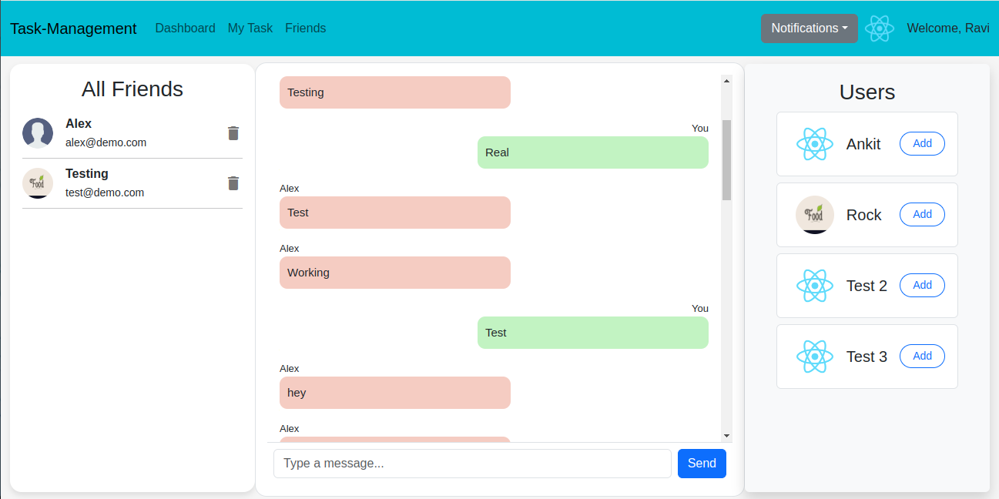
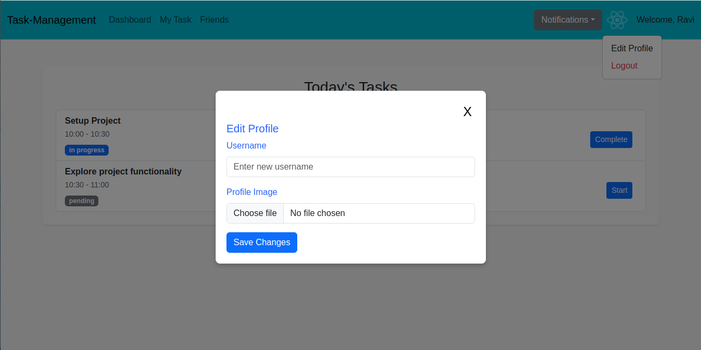

# Task Management Application


## **Overview**

This is a full-stack task management application designed for task scheduling, communication, and user management. It offers real-time features for chat, and a user-friendly interface to enhance productivity.

---


## **Features**

### **1. User Authentication**
- Login and Signup: Users can create an account or log in using their credentials.
- On successful login, users are redirected to the Dashboard.

### **2. Dashboard**
- Displays today's task schedule with details such as:
  - Title
  - Description
  - Scheduled time
  - Current status (e.g., Pending, In Progress, Completed)
- Provides buttons to:
  - Start a task and mark a task as completed

### **3. My Tasks**
- Displays all tasks organized by date.
- Allows users to:
  - View tasks for a specific date via an accordion-style UI.
  - Edit or delete individual tasks.

#### **Add Task**
- Users can add tasks by clicking the **Add Task** button:
  - A modal window opens to:
    - Select the task date.
    - Enter task details such as title, description, start time, and end time.
  - **Validation Features**:
    - Start time must be earlier than the end time.
    - Tasks with overlapping schedules are not allowed.
    - Displays relevant error messages for invalid inputs.
  - Users can add multiple tasks using the Add More Task button.

### **4. Friends Page**
- Displays current user's friends.
- Displays a list of all users who are not part of the friends list.
- Features a Chat Area for real-time messaging with friends.
- **Add Friend Functionality**:
  - Each user has an Add button next to their name to add them as a friend.
  - Sends a friend request to the selected user.
  - Notifications for friend requests appear in the navigation bar in real time.
  - Recipients can accept or reject friend requests.
  - Upon acceptance, the requester and recipient are added to each other's friend list, enabling chat functionality.

### **5. Real-Time Chat and Notifications**
- Notifications for friend requests work in real time.
- Chat messages are updated live without requiring page reloads.

### **6. Profile Management**
- Users can edit their profile by clicking on the user icon in the navigation bar:
  - Opens a dropdown with options to **Edit Profile** or **Logout**.
  - **Edit Profile** opens a modal window where:
    - Users can update their name and profile image.
  - **Logout** logs the user out successfully.


---

## **Setup Instructions**

### Prerequisites
- Node.js installed on your system.
- MongoDB Atlas account or local MongoDB setup.
- A package manager like npm or yarn.

### Steps

1. **Clone the Repository**
   ```bash
   git clone <https://github.com/ankitsaini-ksolves/Task-Management.git>
   cd <repository-folder>

2. **Install Dependencies**
   ```bash
   npm install

3. **Set Up Environment Variables**
- Create a .env file in the root directory.
- Add the following variables:
  ```bash
  MONGO_URI=<your-mongodb-atlas-connection-string>
  PORT=<desired-port-number>

4. **Start the Backend Server**
   ```bash
   node app.js

5. **Start the Frontend**
   ```bash
   npm start

6. **Access the Application**
- Open your browser and navigate to http://localhost:<PORT> 


---

## Screenshots

1. **Login Page**

   

2. **Signup Page**
   
   

3. **Dashboard**

   

4. **My Tasks Page**

   

5. **Add Task**

   

6. **Friends Page**

   

7. **Profile Management**

   


---


## **Technologies Used**

### **Frontend**
- React.js
- Redux for state management
- Bootstrap for styling

### **Backend**
- Node.js
-Express.js

### **Database**
- MongoDB (Atlas)

## **Real-Time Communication**
- Socket.IO for chat and notifications

